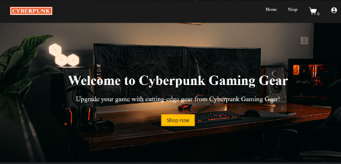

# Welcome to Cyberpunk Gaming Gadgets!

Github repo: https://github.com/jonaskh/gaming-eq-store

This application was designed as a project in NTNU Ålesunds classes WebTechonology and Application Development.

The description of the project is design a website for an online gaming store called Cyberpunk Gaming Gadgets.

The application uses a micro-service approach where the
different services are decoupled from one another.

The services used are:

1. Frontend (ReactJS, JavaScript)
2. Backend (Java Spring Boot)
3. Database (PostgreSQL)
4. Webserver (Nginx)

The website is hosted on http://www.group09.web-tek.ninja for the remainder of the
examination period, after which it will only be available locally. The URL is also only accessible while on NTNUs internal network.

## Installation
In order to run the project locally, Docker must be installed on your computer. Then perform the following steps:

1. Clone the main branch of the repository listed above.
2. Run a Postgres Docker image on port 5432 with a database called Postgres, define username and password to match .env file. The application supports other databases but require configuration.
2. Edit the name of the .envTEMPLATE file in the root directory to ".env", and input some random variable in each value in the file
2. Navigate to the api directory and run the backend, either through a IDEA or through terminal.
3. Navigate to the webapp directory and run "npm install" and "npm start" in the terminal.
4. The website will now be available at localhost:3000

All services are now available, as the database Docker image is launched with the back end.

## Installation on server
1. Connect to the server using SSH mac (terminal) / Or Putty on Windows
2. Create a directory in your users root (/home/local/username) to store the application files
3. CD into the new directory
4. Clone the Server branch into this directory using "sudo git clone --branch Server https://github.com/jonaskh/gaming-eq-store.git ."
5. Move into /api directory using "cd api"
6. Run "sudo mvn clean package" inside the /api directory
7. Move into /webapp directory using "cd webapp"
8. Run "sudo npm run build" inside the /webapp directory
9. Move back into the directory you created holding the application files
10. Run "sudo docker-compose up --build
11. Run "sudo docker cp webapp/build nginx:/usr/share/nginx/html" to copy the build files from the webapp directory into the nginx docker container

Keep in mind that the backend is now setup to only accecpt requests from group09.web-tek.ninja and you would need to change the endpoints and the CORS configuration to run on your specific server.
PS! The .env file should never be commited in your version control. The .env file is only present for demonstration and should only be created on the server.

