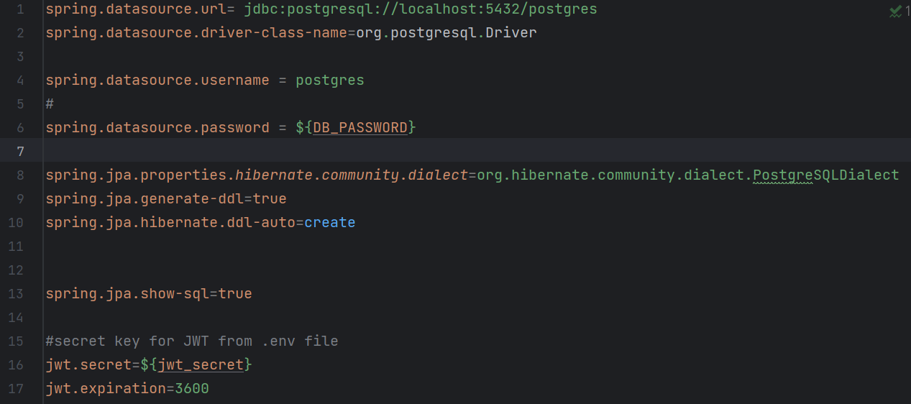
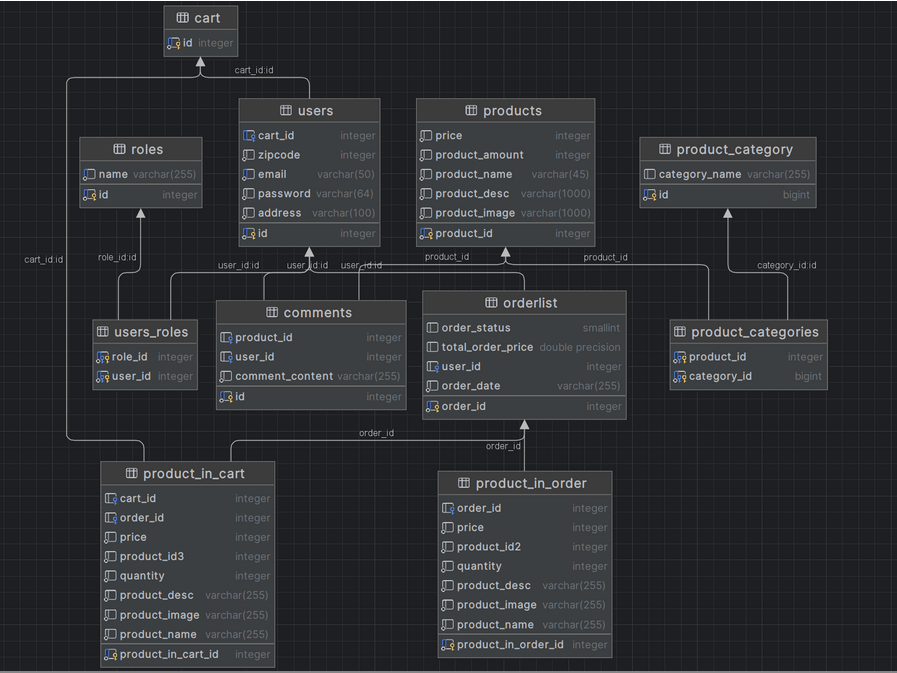

# Welcome to the backend

The backend is created with Java 17 Spring Boot, and is built using Maven.

The backend is dependent on a database connection, established in the application.properties file under resources.

The project uses a RESTful approach where the server and client is separate, and allows them to communicate.

It will work on both PostgreSQL and MySQL, but in order to change database the url and dialect must be changed here.
 Database password and jwt_secret key is created outside of version controlled stored in the .env file.

The ER-diagram of all entities used in the project is shown below.

For authentication JWT is used. Upon registering a user a JWT token is created, containing the user name and which roles the user has.
Each time a user attempts a restricted function (such as accessing admin page or adding item to cart), the front-end verifies the JWT token has the required role and username.

## Installation

In order to run the backend, a Docker Image with a database must also be running and configured in application.properties. 
Assuming a database is running, simply run the main method in an IDEA or through the terminal.