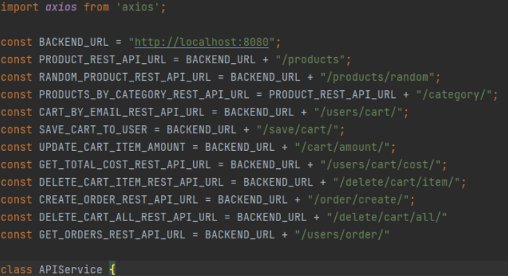

# Welcome to the Frontend

The frontend is created using React 18 and is connected to the backend via axios.js.

The project uses a RESTful approach where the server and client is separate, and allows them to communicate.

The BACKEND_URL needs to point to the correct port that the backend api is running on in order to connect to the backend, but it will run without it, without products from database.

## Installation
In the webapp folder run "npm install" and then "npm start" to run the frontend.

## Pictures